# Lab 1: HTTP File Server with TCP Sockets

## 1. Source Directory Structure

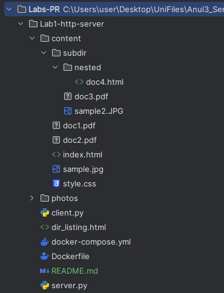

Project source directory containing server.py, client.py, Dockerfile, and docker-compose.yml files.

## 2. Docker Configuration Files
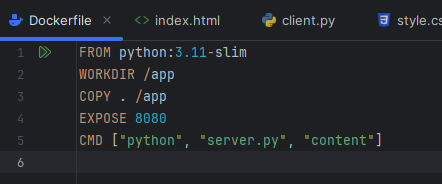

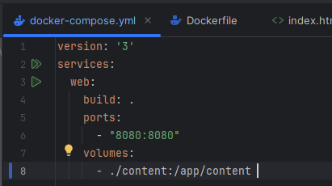

Docker configuration files defining the containerized HTTP server setup.


## 3. Starting the Container
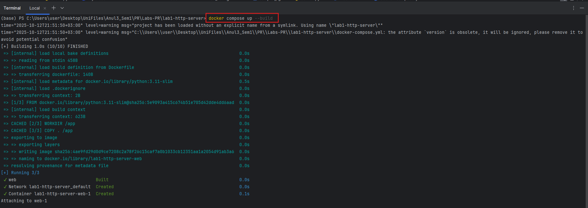

Starting the HTTP server container using docker-compose.

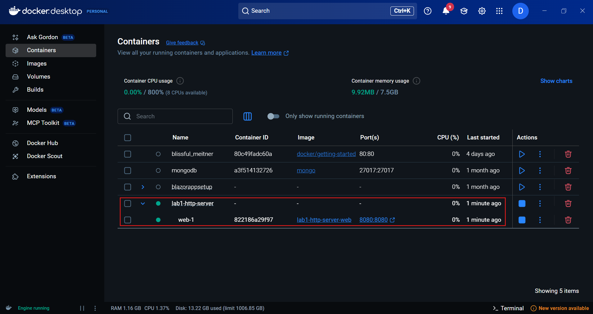


Docker containers running, visible in Docker Desktop.

## 4. Server Command in Container


Server startup logs showing it's serving files from the content directory specified as argument.

## 5. Served Directory Contents

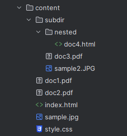

Content directory structure with HTML files, PNG images, PDF files, and subdirectory for testing.

## 6. Browser Requests

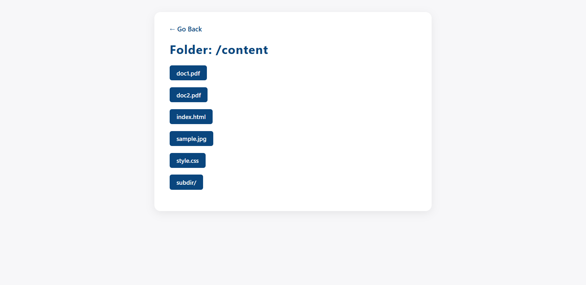

Main page served successfully when accessed via browser.

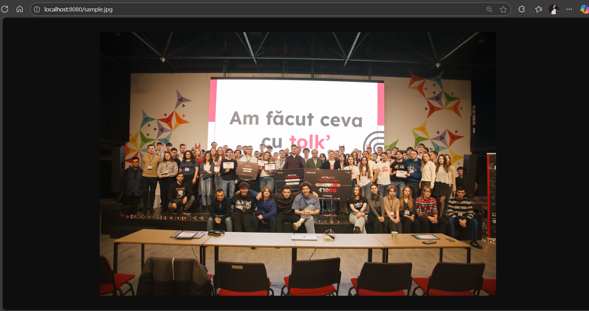

JPG file successfully served and opened in browser.

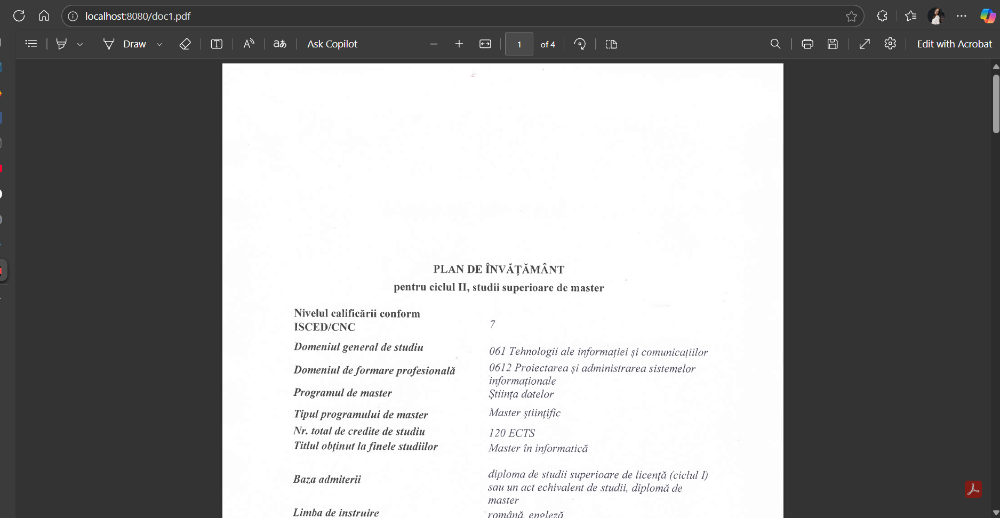

PDF file successfully displayed when accessed directly.

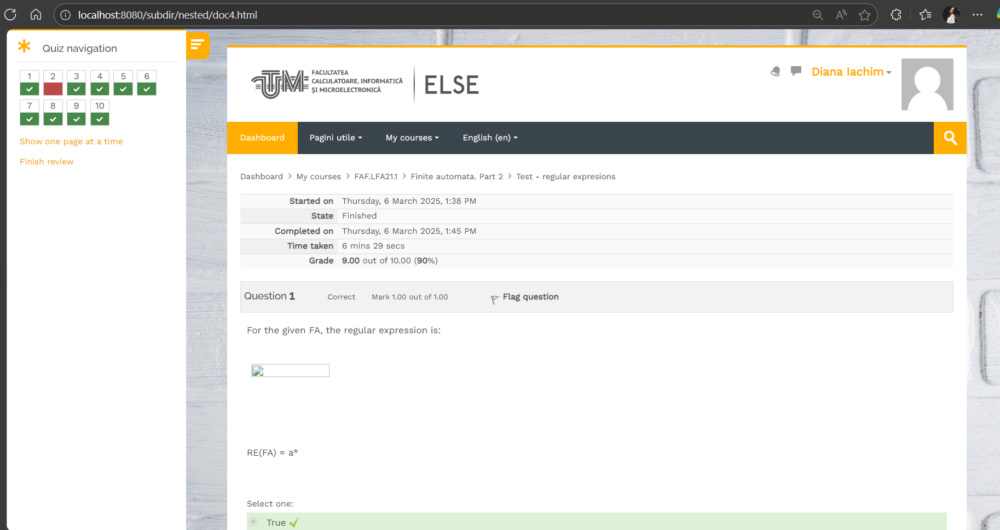

HTML file displayed successfully and opened in browser. 


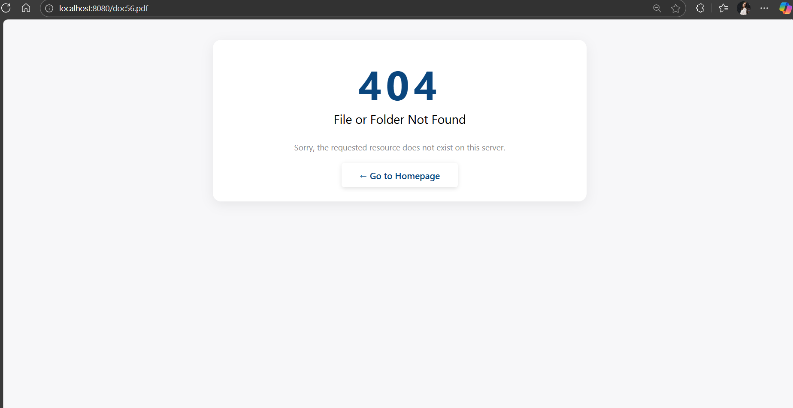
"404 Not Found" response for non-existent file request.

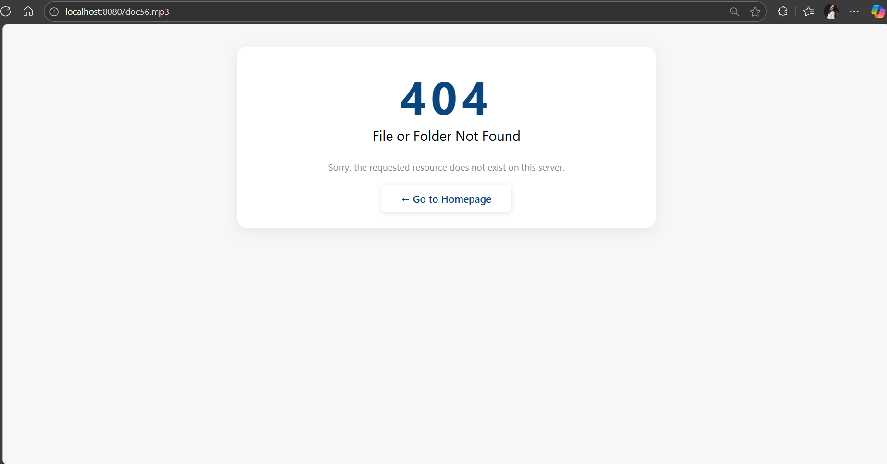

"404 Not Found" response for file with a different extension rather than .pdf, .png and .html.

## 7. Client Implementation

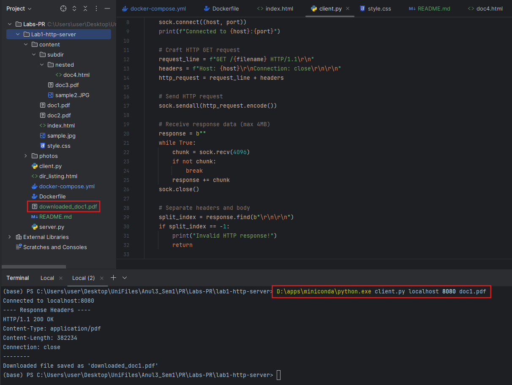

Successful downloading PDF file using curl command in terminal. The command used was: 
```bash 
D:\apps\miniconda\python.exe client.py localhost 8080 doc1.pdf
```

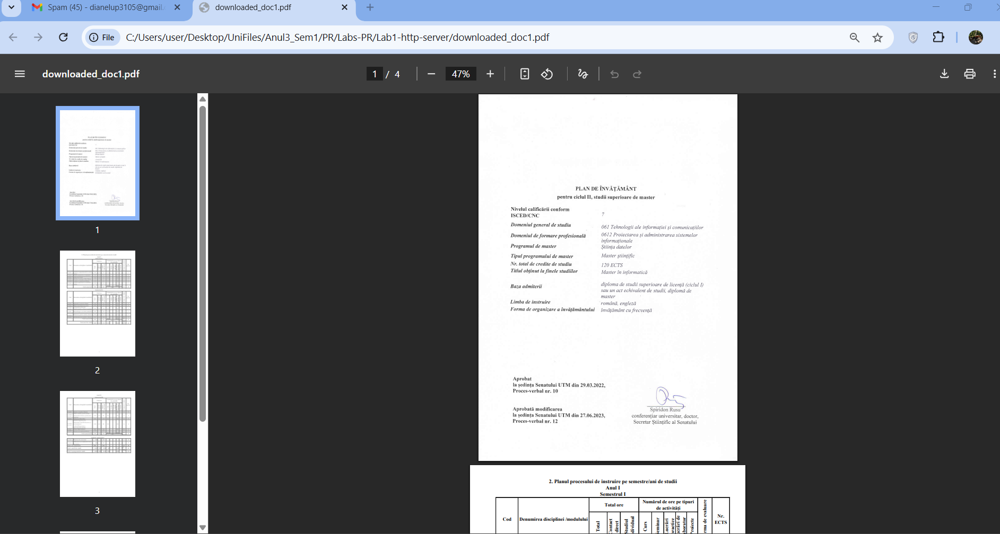
Opened PDF file in browser.

## 8. Directory Listing


Auto-generated directory listing for the /content subdirectory showing clickable PDF files with parent directory navigation and `Go Back` button.


## 9. Friend's Server


Successfully accessing my main page on another device.


