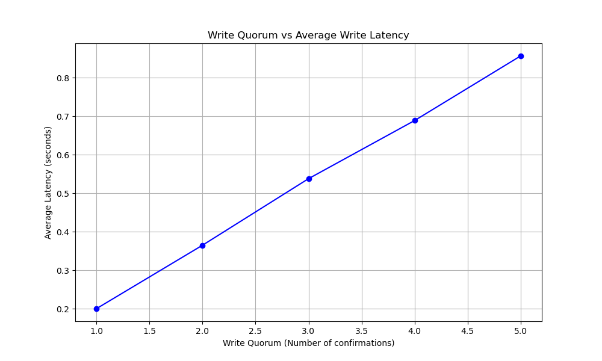

# Lab 4 – Distributed Key-Value Store with Single-Leader Replication

## 1. System architecture

The system runs one Leader and five Followers, each in its own Docker container managed by docker-compose. The service is implemented in Python with FastAPI and uses an in-memory key–value store protected by an asyncio lock. Only the Leader accepts client writes; Followers only accept replication from the Leader.[1][2]

Key properties:
- Single-leader write path (`/write` only on Leader).
- Followers apply replicated writes via `/replicate`.
- All communication is HTTP+JSON.
- Configuration (ROLE, FOLLOWERS, WRITE_QUORUM, MIN_DELAY, MAX_DELAY) is done via environment variables in docker-compose.[2][1]

Example configuration:

```yaml
services:
  leader:
    build: ./app
    environment:
      - ROLE=leader
      - FOLLOWERS=http://follower-1:80,http://follower-2:80,http://follower-3:80,http://follower-4:80,http://follower-5:80
      - WRITE_QUORUM=${WRITE_QUORUM:-1}
      - MIN_DELAY=0
      - MAX_DELAY=1000
    ports:
      - "8000:80"

  follower-1:
    build: ./app
    environment:
      - ROLE=follower
    container_name: kv-follower-1
  # followers 2–5 similarly (kv-follower-2 … kv-follower-5)
```

## 2. API and semi-synchronous replication

Each node exposes a JSON web API: `/write` (leader only), `/replicate` (followers), and `/data` (for consistency checks). The Leader performs a local write, then semi-synchronous replication with a configurable write quorum.[1]

Core configuration and store:

```python
# main.py
ROLE = os.getenv("ROLE", "follower")
FOLLOWERS = os.getenv("FOLLOWERS", "").split(",") if os.getenv("FOLLOWERS") else []
WRITE_QUORUM = int(os.getenv("WRITE_QUORUM", 1))

MIN_DELAY_MS = int(os.getenv("MIN_DELAY", 0))
MAX_DELAY_MS = int(os.getenv("MAX_DELAY", 1000))

store: Dict[str, Any] = {}
lock = asyncio.Lock()
```

Replication endpoint on followers:

```python
@app.post("/replicate")
async def replicate_data(data: WriteRequest):
    if ROLE == "leader":
        raise HTTPException(status_code=400, detail="Leader cannot receive replication")
    async with lock:
        store[data.key] = data.value
    return {"status": "replicated"}
```

Leader write path with concurrent replication, random delay per follower, and quorum:

```python
async def replicate_to_follower(client: httpx.AsyncClient, url: str, data: dict) -> bool:
    if not url:
        return False
    delay = random.uniform(MIN_DELAY_MS, MAX_DELAY_MS) / 1000.0
    await asyncio.sleep(delay)
    try:
        resp = await client.post(f"{url}/replicate", json=data)
        return resp.status_code == 200
    except Exception:
        return False

@app.post("/write")
async def write_data(data: WriteRequest):
    if ROLE != "leader":
        raise HTTPException(status_code=400, detail="Only leader accepts writes")

    # local write
    async with lock:
        store[data.key] = data.value

    # concurrent replication
    async with httpx.AsyncClient() as client:
        tasks = [replicate_to_follower(client, u, data.dict()) for u in FOLLOWERS if u]
        if not tasks:
            return {"status": "written_local_only"}

        acks = 0
        for fut in asyncio.as_completed(tasks):
            if await fut:
                acks += 1
            if acks >= WRITE_QUORUM:
                return {"status": "success", "quorum_met": True}

        raise HTTPException(status_code=500, detail="Write quorum not met")
```

This is semi-synchronous replication: the Leader waits for `WRITE_QUORUM` follower acknowledgements, while remaining replication continues in the background. Random per-follower delay in `[MIN_DELAY, MAX_DELAY]` simulates network lag, and FastAPI + asyncio provide concurrency on both leader and followers.[1]

## 3. Integration test and race-condition behavior

An integration test (`tests.py`) sends concurrent writes and then compares full `/data` snapshots between leader and followers.[3]

Concurrent writes:

```python
LEADER_URL = "http://localhost:8000"
KEYS = [f"test_key_{i}" for i in range(5)]
TEST_WRITES = 50
CONCURRENCY = 5

def send_write(i: int):
    key = KEYS[i % len(KEYS)]
    value = f"test_op_{i}"
    resp = requests.post(f"{LEADER_URL}/write",
                         json={"key": key, "value": value},
                         timeout=10)
    resp.raise_for_status()
    return "success"
```

Consistency check (full JSON equality):

```python
def check_consistency():
    leader_data = requests.get(f"{LEADER_URL}/data", timeout=5).json()
    print(f"Leader key count: {len(leader_data)}")
    mismatches = 0

    for i in range(1, 6):
        container_name = f"kv-follower-{i}"
        cmd = f"docker exec {container_name} curl -s http://localhost:80/data"
        result = subprocess.check_output(cmd, shell=True, timeout=5).decode("utf-8")
        follower_data = json.loads(result)

        if follower_data != leader_data:
            example_key = KEYS[0]
            leader_val = leader_data.get(example_key, "N/A")
            follower_val = follower_data.get(example_key, "N/A")
            print(
                f"FAILURE: Follower {i} ({container_name}) MISMATCH. "
                f"Key '{example_key}': Leader='{leader_val}' vs Follower='{follower_val}'."
            )
            mismatches += 1
        else:
            print(f"SUCCESS: Follower {i} ({container_name}) is consistent.")
```

Observed behavior (example run): all 50 writes succeed at the leader, but after waiting, all 5 followers have different data for `test_key_0` (N/A or older values vs leader’s `test_op_45`), so the integrity check fails. This is intentional: it demonstrates a replication conflict / race condition, as described in the professor’s note.[4][3]

## 4. Performance benchmark: write quorum vs latency and consistency

`benchmark.py` evaluates performance and consistency for different write quorums. It sends 100 writes (10 at a time) to 10 keys, for `WRITE_QUORUM ∈ {1,2,3,4,5}`, measures average latency, and then checks how many followers have caught up.[5][4]

Load test:

```python
LEADER_URL = "http://localhost:8000"
KEYS = [f"key-{i}" for i in range(10)]
TOTAL_WRITES = 100
BATCH_SIZE = 10

def send_write(i):
    key = KEYS[i % len(KEYS)]
    value = f"value-{i}"
    start = time.time()
    try:
        resp = requests.post(f"{LEADER_URL}/write", json={"key": key, "value": value})
        lat = time.time() - start
        return lat, resp.status_code
    except Exception:
        return 0, 500

def run_load_test():
    latencies = []
    with concurrent.futures.ThreadPoolExecutor(max_workers=BATCH_SIZE) as executor:
        futures = [executor.submit(send_write, i) for i in range(TOTAL_WRITES)]
        for future in concurrent.futures.as_completed(futures):
            lat, status = future.result()
            if status == 200:
                latencies.append(lat)
    return sum(latencies) / len(latencies) if latencies else 0
```

Consistency check (key-count based):

```python
def check_consistency():
    print("Checking consistency...")
    try:
        leader_data = requests.get(f"{LEADER_URL}/data").json()
    except:
        print("Could not contact leader.")
        return

    mismatches = 0
    for i in range(1, 6):
        container_name = f"kv-follower-{i}"
        cmd = f"docker exec {container_name} curl -s http://localhost:80/data"
        try:
            result = subprocess.check_output(cmd, shell=True)
            follower_data = json.loads(result)
            if len(follower_data) != len(leader_data):
                mismatches += 1
                print(f"Follower {i} MISMATCH: Leader {len(leader_data)} vs Follower {len(follower_data)}")
        except Exception as e:
            print(f"Error checking follower {i}: {e}")

    if mismatches == 0:
        print("SUCCESS: All replicas match the leader!")
    else:
        print(f"WARNING: {mismatches} followers out of sync (Expected due to eventual consistency if checked immediately).")
```

Main loop and plot:

```python
def main():
    quorums = [1, 2, 3, 4, 5]
    avg_latencies = []

    for q in quorums:
        restart_docker(q)
        print(f"Running load test for Quorum={q}...")
        latency = run_load_test()
        avg_latencies.append(latency)
        print(f"Average Latency: {latency:.4f}s")

        time.sleep(2)
        check_consistency()

    plt.figure(figsize=(10, 6))
    plt.plot(quorums, avg_latencies, marker="o", linestyle="-", color="b")
    plt.title("Write Quorum vs Average Write Latency")
    plt.xlabel("Write Quorum (Number of confirmations)")
    plt.ylabel("Average Latency (seconds)")
    plt.grid(True)
    plt.savefig("quorum_latency_analysis.png")
```

Observed results from your run:

- Quorum = 1:
  - Average latency ≈ 0.20 s.
  - Several followers have fewer keys than the leader (e.g., 10 vs 9 or 7) → 3 followers out of sync.
- Quorum = 2:
  - Average latency ≈ 0.36 s.
  - 1 follower out of sync.
- Quorums = 3, 4, 5:
  - Latency increases (≈ 0.54 s, 0.69 s, 0.86 s).
  - At check time, “SUCCESS: All replicas match the leader!”.

>

Interpretation:
- Higher `WRITE_QUORUM` increases average write latency because the leader waits for more follower acknowledgements before responding.
- Lower quorums return faster but more often leave some followers behind at the time of consistency checks, exposing the race-condition / replication-conflict behavior your professor wanted you to see.
